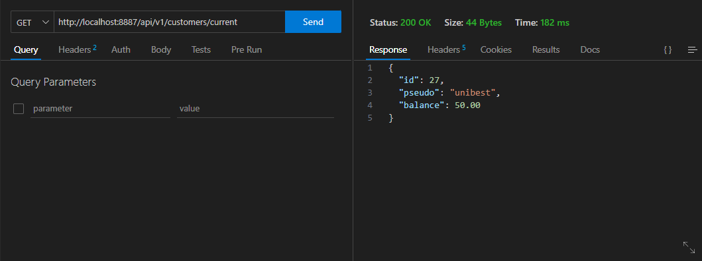
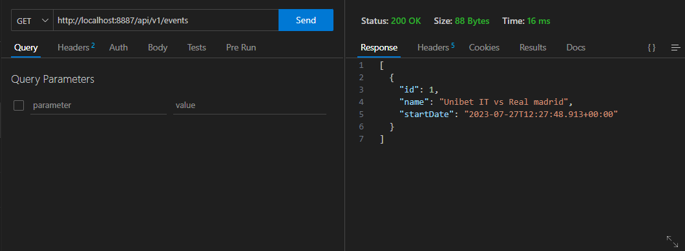
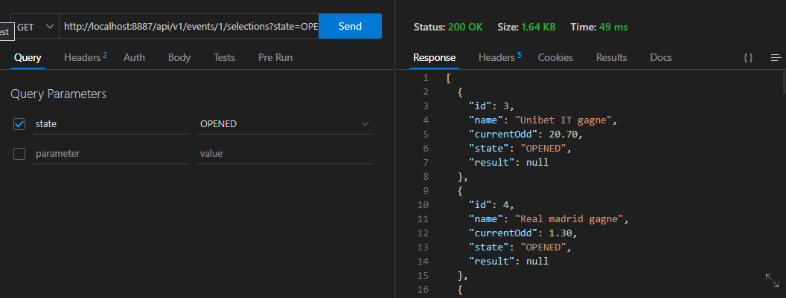

# Test Technique

Test Technique KINDRED - UNIBET France.

## Contenu du repositoire
1. src : code source de l'API.

2. enonce.pdf : enoncé du test technique.

3. solution.pdf : versions et choix techniques de la solution proposée. 


## Lancer l'API

Pour lancer l'API réalisé avec Spring Boot, se placer dans le répertoire "src" contenant le fichier "pom.xml" et exécuter les commandes suivantes.

1. Supprimer les fichiers compilés, installer les dépendances, compiler, tester et créer un paquet du projet.
```bash
.\mvnw.cmd clean install
```
2. lancer le projet
```bash
.\mvnw.cmd spring-boot:run
```

L'API est lancé en local sur le port 8887

## Tester l'API

1. Récupérer le client actuel




2. Récupérer les événements




3. Récupérer les sélections ouvertes




4. Ajouter une mise


